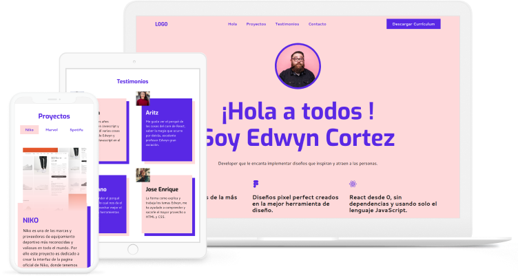

<h1 align="center">Portafolio web - Edwyn</h1>

<div align="center">
  Solución del portafolio web de Edwyn
</div>

<div align="center">
  <h3>
    <a href="https://portafolio-edwyn-cse.netlify.app/">
      Demo
    </a>
    <span> | </span>
    <a href="https://github.com/carlossantesp/portafolio-edwin">
      Solución
    </a>
    <span> | </span>
    <a href="https://leonidasesteban.com/proyectos/portafolio-edwyn">
      Diseño del proyecto
    </a>
  </h3>
</div>

## Tabla de contenido

- [Información](#información)
- [Desarrollado con](#desarrollado-con)
- [Agradecimiento](#agradecimiento)
- [Instalación](#instalación)
- [Contacto](#contacto)

## Información



Edwyn es un Frontend Developer creativo y organizado. Esto se refleja directamente en su portafolio y ahora tú puedes seguir su ejemplo.. Revisa el demo [aquí](https://portafolio-edwyn-cse.netlify.app/)

## Desarrollado con

- [React](https://es.reactjs.org/docs/getting-started.html)
- [Nextjs](https://nextjs.org/docs)
- [CSS Modules](https://nextjs.org/docs/basic-features/built-in-css-support#adding-component-level-css)
- [React scroll](https://www.npmjs.com/package/react-scroll)

## Agradecimiento

Este proyecto y muchos más lo puedes encontrar en [leonidasesteban.com/proyectos](https://leonidasesteban.com/proyectos).

## Instalación

- Descargar el repositorio
  ```bash
  $ git clone https://github.com/carlossantesp/portafolio-edwin.git
  ```
- Instalar las dependecias

  **NPM**
  ```bash
  $ npm install
  ```

  **YARN**
  ```bash
  $ yarn install
  ```
- Ejecutar servidor de desarrollo

  **NPM**
  ```bash
  $ npm run dev
  ```

  **YARN**
  ```bash
  $ yarn dev
  ```
- Construir sitio web para el deploy

  **NPM**
  ```bash
  $ npm run export
  ```

  **YARN**
  ```bash
  $ yarn export
  ```

## Contacto

- Portafolio web [carlos.santillan.dev](https://carlos.santillan.dev)
- GitHub [@carlossantesp](https://github.com/carlossantesp)
- Linkedin [@dev-santillan-carlos](https://www.linkedin.com/in/dev-santillan-carlos)
